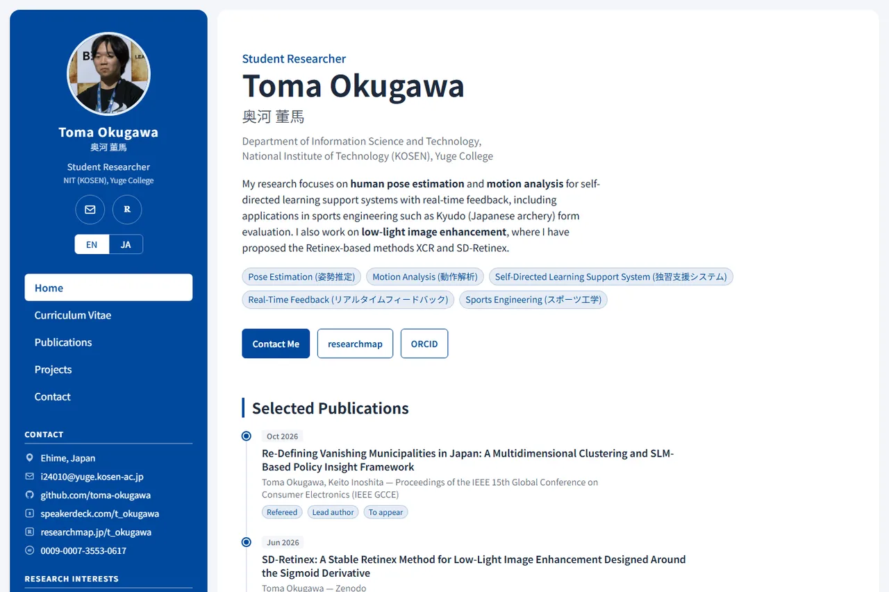

<div align="center">

# t-okugawa.dev

**Portfolio and academic CV of Toma Okugawa — a bilingual (EN / JA) static site built with Astro + Tailwind CSS (daisyUI), deployed on Cloudflare Pages.**

[](https://t-okugawa.dev)
[](https://github.com/toma-okugawa/portfolio/actions/workflows/ci.yml)
[](https://github.com/toma-okugawa/portfolio/releases)
[](LICENSE)
[](https://astro.build)

<br>

<a href="https://t-okugawa.dev"></a>

</div>

<br>

## What it is

- **Bilingual routing** — `/` (English) and `/ja/` with `hreflang` alternates, a locale-aware sitemap, and Open Graph / Twitter cards per locale
- **Structured data** — `Person` and `WebSite` JSON-LD with `sameAs` links to researchmap, ORCID, J-GLOBAL, GitHub, and Speaker Deck
- **Academic CV pages** — publications, awards, projects, and a full CV, sourced from a [researchmap](https://researchmap.jp/t_okugawa) export that is kept out of the repository
- **Fully static** — no client-side framework; all CSS is inlined at build time so nothing render-blocking is fetched
- **Release automation** — [release-please](https://github.com/googleapis/release-please-action) turns Conventional Commits into a versioned GitHub Release, a `site-vX.Y.Z.zip`, and an nginx container image on `ghcr.io`
- **Hardened delivery** — `X-Frame-Options`, `Permissions-Policy`, `Referrer-Policy`, and `X-Content-Type-Options` via Cloudflare Pages `_headers`

## Quick start

```bash
corepack enable          # enables pnpm (once)
pnpm install
pnpm dev                 # http://localhost:4321/
pnpm build               # static build into dist/
```

Any release can be run locally from the container image:

```bash
docker run --rm -p 8080:80 ghcr.io/toma-okugawa/portfolio:latest
```

## Credits

Built on the [Astrofy](https://github.com/manuelernestog/astrofy) template by Manuel Ernesto Garcia (MIT). The template's copyright notice is retained in [LICENSE](LICENSE) alongside the copyright for the modifications and site content.

---

## 日本語

奥河 董馬 (Toma Okugawa) のポートフォリオ / 学術 CV サイトです。
Astro + Tailwind CSS (daisyUI) 製の静的サイトで、Cloudflare Pages で公開しています。

- 基調カラー: `#00489D` (`tailwind.config.cjs` のカスタム daisyUI テーマ `resume` で定義)
- 掲載内容の情報源: [researchmap](https://researchmap.jp/t_okugawa) のエクスポートデータ
  (`researchmap.json` — 個人情報を含むためリポジトリには含めていません)

### 構成

| パス | 内容 |
| --- | --- |
| `src/pages/index.astro` | Home (プロフィール・主要業績・受賞) |
| `src/pages/cv.astro` | Curriculum Vitae |
| `src/pages/publications.astro` | 論文・発表一覧 |
| `src/pages/projects.astro` | 研究課題・制作物 |
| `src/components/` | 共通コンポーネント (サイドバー・タイムライン Entry など) |
| `src/config.ts` | サイト全体の定数 (名前・連絡先・URL) |

### 開発

```bash
corepack enable          # pnpm を有効化 (初回のみ)
pnpm install
pnpm dev                 # http://localhost:4321/
pnpm build               # dist/ に静的ビルド
pnpm preview             # ビルド結果の確認
```

### デプロイ (Cloudflare Pages)

Cloudflare ダッシュボードで本リポジトリを接続し、以下を設定してください。

| 設定 | 値 |
| --- | --- |
| Framework preset | Astro |
| Build command | `pnpm build` |
| Build output directory | `dist` |

`package.json` の `packageManager` と `.node-version` を Cloudflare が自動検出します。
公開 URL を変更する場合は `astro.config.mjs` の `site` と `public/robots.txt` の Sitemap URL を更新してください。

> **Note**: Cloudflare の「Email Address Obfuscation」(Scrape Shield) が有効だと、ページに `email-decode.min.js` が注入されてレンダリングをブロックします (Lighthouse 計測で約 0.9 秒)。本サイトはメールアドレスをモーダルで扱っているため、この機能はオフにして構いません。

### 開発フロー (Git / GitHub)

- 作業は **Issue 起点**で管理します: 課題・改善は Issue に起票し、ラベル (`responsive` / `a11y` / `ui` / `disclosure` / `polish` など) で分類
- `main` への直接 push は禁止 (ブランチ保護 ruleset)。変更は必ずブランチ → Pull Request 経由で行います
- PR 本文の `Closes #N` で対応 Issue を紐付け、マージと同時にクローズします
- PR は GitHub Actions の CI (`build`) が通ることがマージ条件です
- コミットは [Conventional Commits](https://www.conventionalcommits.org/) 形式 (`feat:` / `fix:` / `chore:` など)
- 依存関係の更新は Dependabot が毎週月曜に PR を作成します (`chore(deps)` / `chore(ci)`)

### リリース (Releases)

[release-please](https://github.com/googleapis/release-please-action) による自動リリース管理です。

1. main へのマージが積まれると、release-please が **リリース PR** (バージョン更新 + CHANGELOG) を自動作成・更新します
2. リリース PR をマージすると、**タグ + GitHub Release が自動作成**されます
3. バージョンは Conventional Commits から自動決定 (`feat:` → minor / `fix:` → patch)

> **Note**: リリース PR は GITHUB_TOKEN で作られるため CI が自動起動しません。PR を一度 **Close → Reopen** すると `build` チェックが走ります (恒久対応する場合は PAT を Actions シークレットに登録して workflow の `token` に渡してください)。

### パッケージ (Packages)

Release の公開をトリガーに、ビルド済みサイトが2形態で自動配布されます:

| 形態 | 場所 |
| --- | --- |
| `site-vX.Y.Z.zip` (dist 一式) | Release のアセット |
| コンテナイメージ (nginx 配信) | `ghcr.io/toma-okugawa/portfolio` (`latest` / `X.Y.Z` / `X.Y`) |

任意のリリース時点のサイトをローカルで再現できます:

```bash
docker run --rm -p 8080:80 ghcr.io/toma-okugawa/portfolio:latest
# → http://localhost:8080
```

> **Note**: 初回 push 時のパッケージは private です。公開する場合はパッケージ設定 → Danger Zone → Change visibility から Public に変更してください (一度 Public にすると Private へは戻せません)。

### ライセンス

MIT License。テンプレート [Astrofy](https://github.com/manuelernestog/astrofy) (Manuel Ernesto Garcia) の著作権表示を保持し、改変部分とサイト内容の著作権表示を併記しています。詳細は [LICENSE](LICENSE) を参照してください。
